# ZeroHost Dashboard

Game server management dashboard for the ZeroHost platform. Provides user-facing server lifecycle management (creation, renewal, suspension, deletion) backed by a panel API.

> [!NOTE]
> The dashboard is now in "cruise mode", instead of dozens of commits a day, expect around 2-3 commits per day going forward, as I'm juggling other projects on the side. That said, there will still be days with bigger pushes when needed.

---

## Table of Contents

- [Panel Compatibility](#panel-compatibility)
- [Architecture Overview](#architecture-overview)
- [Tech Stack](#tech-stack)
- [Project Structure](#project-structure)
- [Request Lifecycle](#request-lifecycle)
- [Routing](#routing)
- [Database Schema](#database-schema)
- [Authentication Flow](#authentication-flow)
- [Server Lifecycle](#server-lifecycle)
- [Scheduler](#scheduler)
- [Configuration](#configuration)
- [Deployment](#deployment)

---

## Panel Compatibility

| Panel | Status |
|---|---|
| Pterodactyl | ⚠️ Not fully tested |
| Pyrodactyl | ✅ Tested — working |
| Hydrodactyl | ✅ Tested — working |
| Pelican | ❓ Not tested |

## Architecture Overview

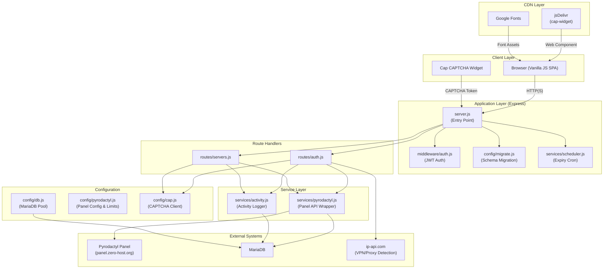

---

## Tech Stack

| Component | Technology |
|---|---|
| Runtime | Node.js >= 18 (ES Modules) |
| HTTP Framework | Express 4.21 |
| Database | MariaDB via `mariadb` driver 3.4 |
| Authentication | JWT (HS256, `jsonwebtoken` 9) |
| Password Hashing | Argon2id (`argon2` 0.41) |
| Frontend | Vanilla JavaScript (SPA, no framework) |
| Styling | Custom CSS |
| CAPTCHA | Self-hosted Cap CAPTCHA |
| Panel API | Pterodactyl / Pyrodactyl Application API |
| Process Manager | PM2 |
| CI/CD | GitHub Actions (SSH deploy) |

---

## Project Structure

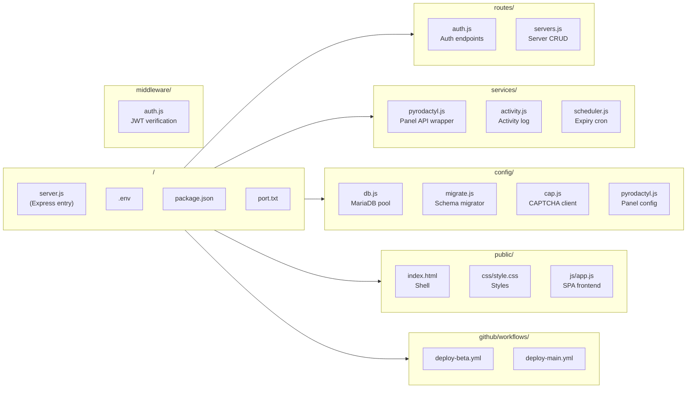

---

## Request Lifecycle

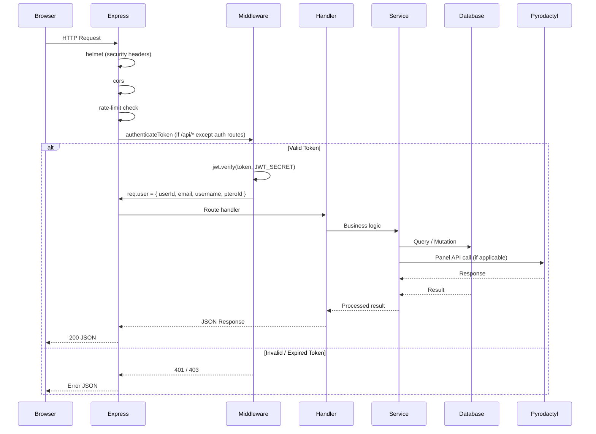

---

## Routing

### Frontend SPA Routes

```mermaid
flowchart TD
    A["/ or /overview\nDashboard Home"] --> B["Stat Cards\n(Total/Active/Slots/To-Renew)"]
    A --> C["Resource Usage\n(RAM/CPU/Disk bars)"]
    A --> D["Recent Servers\n(List of last 5)"]
    A --> E["Recent Activity\n(Timeline)"]

    F["/servers\nServer List"] --> G["Table with search & filter"]
    G --> H["Settings Button"]
    G --> I["Open Panel Button"]
    G --> J["Renew Button"]

    K["/server/:id\nServer Detail"] --> L["Tab: Info\n(egg, allocation, lifetime)"]
    K --> M["Tab: Resources\n(live CPU/Memory/Disk gauges)"]
    K --> N["Tab: Actions\n(Open, Reinstall, Delete)"]

    O["/create\nCreate Server"] --> P["Name Input"]
    O --> Q["Egg Selector\n(grouped by nest)"]
    O --> R["Cap CAPTCHA"]
    O --> S["Default Limits\n(512MB/50%/3GB)"]

    T["/pyrodactyl\nPanel Redirect"] --> U["5-second auto-redirect\nto panel.zero-host.org"]

    V["/account\nAccount Hub"] --> W["/account/edit\n(Email, Password, API Key)"]
    V --> Y["/account/dangerous\n(Delete Account, RGPD Export)"]

    Z["/log\nActivity Log"] --> AA["Paginated list\n(50 per page)"]
```

### Backend API Endpoints

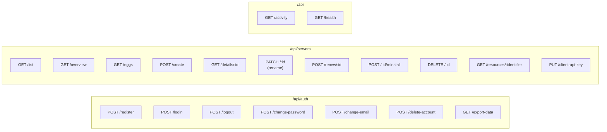

---

## Database Schema

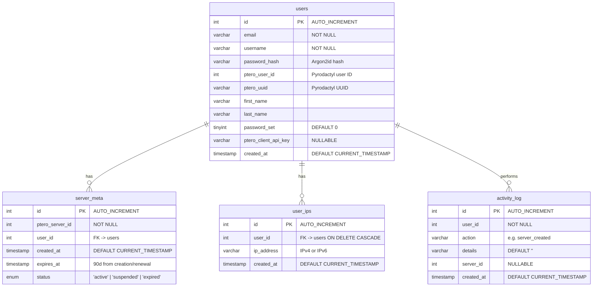

### Indexes & Constraints

| Table | Index / Constraint | Type |
|---|---|---|
| `server_meta` | `idx_expires` (expires_at) | Index |
| `server_meta` | `idx_user` (user_id) | Index |
| `server_meta` | `idx_status` (status) | Index |
| `user_ips` | `idx_ip` (ip_address) | Index |
| `user_ips` | `idx_user` (user_id) | Index |
| `user_ips` | `fk_user_ips_user` (user_id -> users.id) | Foreign Key (CASCADE) |
| `activity_log` | `idx_activity_user` (user_id) | Index |
| `activity_log` | `idx_activity_created` (created_at) | Index |

### External Table (panel database, not migrated by this project)

| Table | Columns |
|---|---|
| `panel.egg_variables` | `egg_id`, `name`, `env_variable`, `default_value`, `rules`, `description`, `user_viewable`, `user_editable` |

---

## Authentication Flow

### Registration

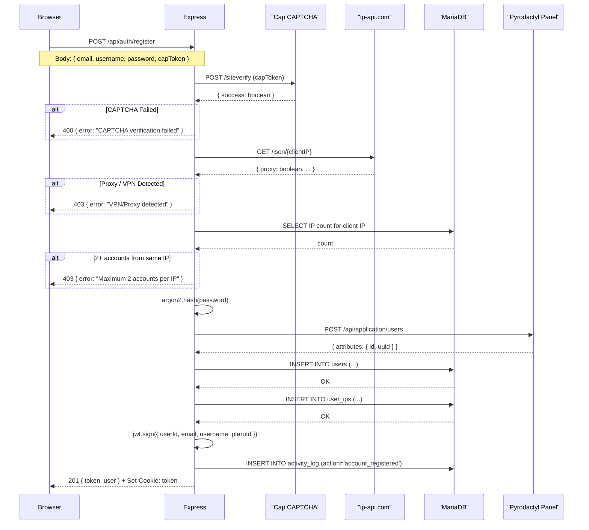

### Login

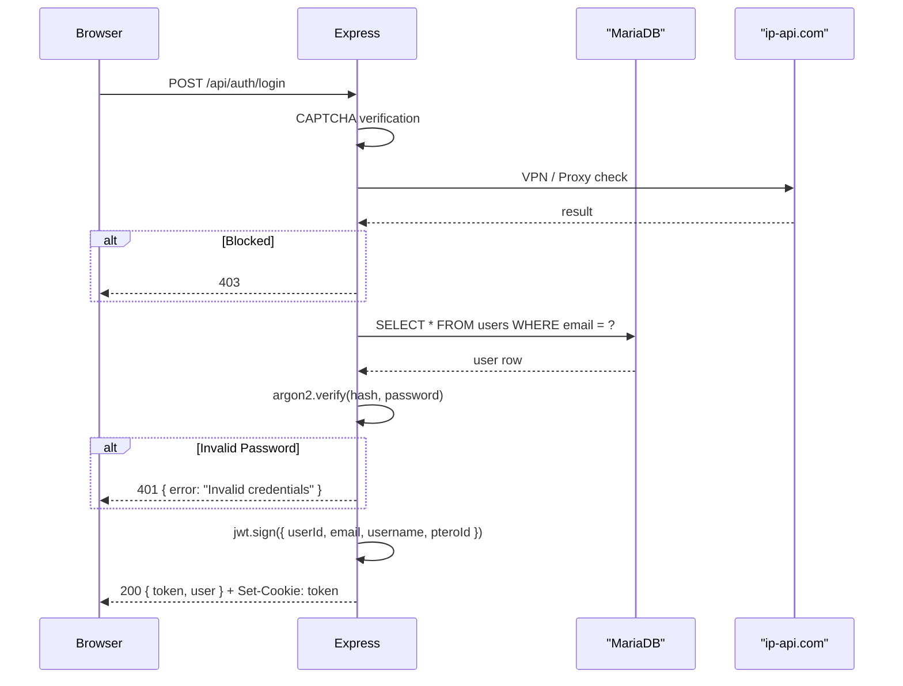

---

## Server Lifecycle

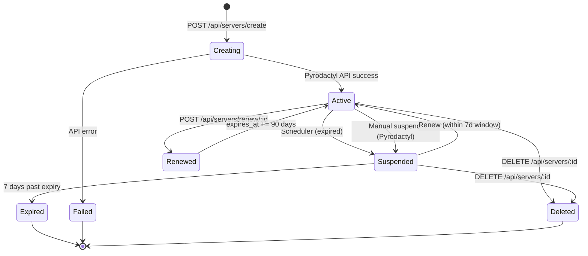

### Server Default Limits

| Resource | Value |
|---|---|
| RAM | 512 MB |
| CPU | 50% |
| Disk | 3 GB |
| Swap | 0 |
| Backups | 1 |
| Allocations | 1 |

### Renewal Policy

- Servers expire 90 days after creation or last renewal.
- Renewal is only permitted within a 7-day window before or after the expiration date.
- Renewing an expired server automatically unsuspends it.

---

## Scheduler

The scheduler (`services/scheduler.js`) runs daily at midnight via `setInterval`:

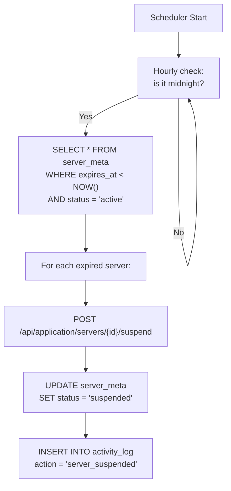

---

## Configuration

### Environment Variables (.env)

| Variable | Description |
|---|---|
| `JWT_SECRET` | Secret key for JWT signing (HS256) |
| `JWT_EXPIRES_IN` | Token expiry duration (default: `2h`) |
| `COOKIE_SECRET` | Secret for signed cookies |
| `DB_HOST` | MariaDB host |
| `DB_USER` | MariaDB user |
| `DB_PASSWORD` | MariaDB password |
| `DB_NAME` | MariaDB database name |
| `DB_PORT` | MariaDB port (default: 3306) |
| `PTERO_URL` | Pyrodactyl panel base URL |
| `PTERO_API_KEY` | Pyrodactyl Application API key |
| `CAP_ENDPOINT` | Cap CAPTCHA endpoint URL |
| `CAP_SECRET` | Cap CAPTCHA secret key |
| `NODE_ENV` | `production` or `development` |

### Rate Limiting

| Scope | Window | Max Requests |
|---|---|---|
| Auth endpoints (login, register) | 15 minutes | 10 |
| General API | 60 seconds | 100 |

---

## Deployment

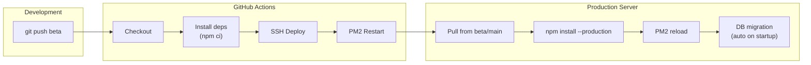

Two deployment workflows are configured:

- **deploy-beta.yml**: Triggered on push to `beta` branch.
- **deploy-main.yml**: Triggered on push to `main` branch.

Both use SSH credentials configured as GitHub repository secrets (`SSH_HOST`, `SSH_USER`, `SSH_PASSWORD`, `SSH_PORT`).

---

## GitHub Stats

